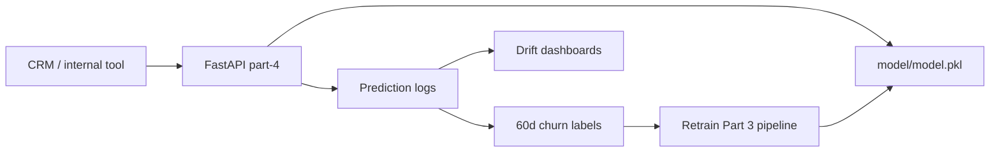

# Churn Scoring API — Monitoring Plan & Responsible Use

This plan applies to the Part 4 FastAPI service that loads **`model/model.pkl`** (XGBoost pipeline from Part 3) and classifies customers at decision threshold **0.20** (`model/metrics.json`). Baseline model quality on held-out data: validation ROC-AUC **~0.88**, PR-AUC **~0.86**.

---

## 1. What to monitor after deployment

### A. API and infrastructure health

| Signal | Why it matters | Suggested action |
|--------|----------------|------------------|
| **Availability** (`GET /health` → 200, `model_loaded: true`) | CRM cannot score if the pipeline fails to load | Alert on repeated 503 or failed health checks |
| **Latency** (p50 / p95 / p99 per endpoint) | CRM may call `/predict` synchronously | Investigate if p95 consistently exceeds ~100ms on expected hardware |
| **Error rate** (4xx vs 5xx) | 422 = bad client payloads; 5xx = server/inference failures | Track 5xx; target low single-digit % under normal load |
| **Throughput** (requests per minute) | Capacity planning | Scale replicas if CPU or latency degrades under peak CRM traffic |

Log each request with: timestamp, endpoint, status code, latency_ms, and (for audits) a hashed `customer_id` if the CRM passes one — never log full PII in plain text.

### B. Prediction and model-quality drift

| Signal | Why it matters | Suggested action |
|--------|----------------|------------------|
| **Score distribution** (daily mean/median `churn_probability`) | Sudden shifts may indicate broken features upstream | Compare to validation-era distribution; investigate spikes |
| **Flag rate** (% with `predicted_class == 1`, threshold **≥ 0.20**) | Drives campaign volume and cost | If flag rate doubles without a known campaign change, pause auto-offers and review inputs |
| **Delayed ground truth** (actual `churn_next_60d` after 60 days) | Measures real model performance in production | Join historical API logs to outcomes; recompute precision, recall, PR-AUC monthly |
| **Recall on churners** | Missing churners is costly (lost CLV) | Review if recall on labeled cohort falls materially below Part 3 validation (~0.65+ at threshold 0.20) |

Store daily aggregates: count of predictions, histogram buckets of probability, and count flagged high-risk.

### C. Data and feature drift (input to the API)

Compare live request payloads to the **training cohort** (Part 3 train split, snapshot **2025-09-30**):

| Signal | Method | Trigger |
|--------|--------|---------|
| **Numeric drift** | Population Stability Index (PSI) on `recency_days`, `ticket_count_90d`, `sessions_30d`, `monetary_180d` | PSI ≥ **0.2** → review pipeline; PSI ≥ **0.25** on any top-3 feature → consider emergency retrain |
| **Categorical drift** | Share of `loyalty_tier`, `city_tier`, `acquisition_channel` vs training | Large unexpected shifts (e.g. spike in `"Unknown"`) |
| **Missing / default usage** | Rate of omitted fields filled by API defaults | Spike in defaults may mean CRM stopped sending features |
| **Out-of-range values** | Pydantic rejects many bad types (422); monitor rejection rate | High 422 rate → fix CRM integration |

**Leakage guard:** Production feature builders must only use data on or before the scoring snapshot date (see `DATA_DICTIONARY.md`). Post-snapshot orders must never be sent as inputs.

### D. Business outcomes

| Signal | Why it matters |
|--------|----------------|
| **Offer redemption** (e.g. ₹30 welcome-back) | Validates that high-risk flags convert to retention |
| **Margin protection** | Low-risk customers should not receive aggressive discounts |
| **VIP outreach quality** | Gold/Silver/Platinum high-risk cases: support-led vs blanket discount |
| **Consent compliance** | `marketing_consent == "No"` → no unsolicited email/SMS/WhatsApp offers |

Link campaigns to prediction logs to estimate lift (treated vs holdout where ethically allowed).

---

## 2. Retraining triggers

1. **Scheduled:** Retrain every **90 days** on a new rolling snapshot (e.g. last 6 months of pre-snapshot features), re-export `model.pkl` and `metrics.json`, redeploy Part 4.
2. **Performance-based:** If 60-day rolling **recall** on labeled outcomes drops below **0.60**, or weekly PSI on any top-3 feature exceeds **0.25**, stop automated discount triggers and run an emergency retrain/review.
3. **API artifact mismatch:** If health checks report wrong `features_expected` or load errors after deploy, roll back to the previous `model.pkl` version.

---

## 3. Responsible use (CRM / retention team)

### Should do

- Use scores to **prioritize** retention effort, not to deny service or support.
- For **high-risk VIPs** (Gold/Silver/Platinum): prefer support resolution and loyalty rewards over deep discounting.
- For **standard high-risk** customers: use the approved ₹30 (or equivalent) offer where ROI is positive.
- Use support features to **escalate** frustrated customers (`negative_ticket_rate_90d`, open tickets).
- Honor **`marketing_consent == "No"`** with non-intrusive channels only (e.g. in-session prompts).

### Should not do

- **Dynamic price increases** or punitive pricing based on churn score.
- **Support deprioritization** or shipping denial for high-risk customers.
- **Demographic discrimination** — do not change offer value by `age_group`, `city_tier`, or `skin_type`.
- **Spammy “are you leaving?”** messaging; keep outreach helpful and on-brand.
- Treat the model as **ground truth** — it is a ranking aid; combine with human review for edge cases (see Part 3 `error_analysis.md`).

---

## 4. Architecture overview

---

## 5. References

- Feature definitions: `DATA_DICTIONARY.md`
- Model performance and threshold rationale: Part 3 `model_card.md`, `metrics.json`
- Error patterns and manual review: Part 3 `error_analysis.md`
